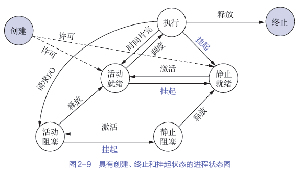
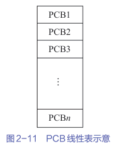
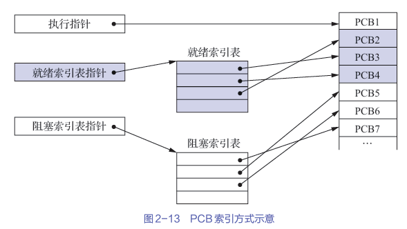

+++
date = '2025-12-26T21:23:39+08:00'
draft = false
title = '计算机操作系统'
description = "本文梳理书中（《计算机操作系统（慕课版）》）知识点，复习用。"
+++
...

# 进程的描述与控制
...

## 进程的描述
### 进程的定义与特征
传统OS中进程的定义：进程是程序的*执行过程*，是系统进行*资源分配*和*调度*的一个**独立单位**。

进程的四个特性：
    - **动态性**，最基本特性。进程的本质是程序的动态执行。
    - **并发性**，重要特性。进程的目的就是为了使进程和其他进程并发执行。
    - **独立性**。晋城市独立运行、独立获得资源、独立接受调度的基本单位。
    - **异步性**。进程是并发结果可再现的基础，为并发结果的再现提供了可能。

### 进程的基本状态与转换
进程的五种**基本状态**：
    1. 就绪态，进程已分配好除CPU外的所有资源。
    2. 执行态，进程正在执行。
    3. 阻塞态，进程由于某些事件的发生被阻塞，这时会发生进程调度。
    4. 创建状态。引入创建状态是为了保证进程的调度必须在创建工作完成后进行。
    5. 终止状态。

进程状态间的转换图：

### 挂起操作和进程状态的转换
挂起是操作系统为了满足系统和用户观察与分析进程的需要而引入的，是三个基本状态之外的、面向进程的重要操作。

挂起操作主要是为了满足以下需要：
    1. 终端用户的需要：终端用户希望能够暂停运行中的程序，以便研究执行情况或对其进行修改等。
    2. 父进程的需要：父进程有时需要挂起自己的某个子进程，以便考察和修改该紫禁城，或者协调各个进程间的活动。
    3. 负荷调节的需要：当实时系统中工作负荷较重，系统为保证自身能正常运行，可能把一些不重要的进程挂起。
    4. OS的需要：OS有时希望挂起某些进程，以便检查在进程运行过程中资源的使用情况或者进行记账（CPU时间、实际使用时间、作业或进程数量等）。

引入挂起操作后进程3个基本状态间的转换：
    挂起原语Suspend和激活源于Active（成对使用）的共同作用下，进程可能发生这些状态转换。
    1. 活动就绪 -> 静止就绪
    2. 活动阻塞 -> 静止阻塞
    3. 静止就绪 -> 活动就绪
    4. 静止阻塞 -> 活动阻塞
    引入创建和终止状态后，还需补充
    1. NULL -> 创建
    2. 创建 -> 活动就绪
    3. 创建 -> 静止就绪
    4. 执行 -> 终止

具有挂起状态的进程状态图：

### 进程管理中的数据结构
PCB进程控制块，专门用来描述进程的*基本情况*和*活动过程*的**数据结构**。

进程中的信息：
    1. 进程标识符
        - 外部标识符，方便用户（进程）对进程的访问
        - 内部标识符，方便系统对进程的使用，通常是进程的序号
    2. 处理机状态
        - 通用寄存器
        - 指令计数器
        - 程序状态字寄存器，其中包含状态信息（条件码、执行方式、中断屏蔽标志等）
        - 用户栈指针寄存器，指每个用户进程都有一个或若干个与之相关的系统栈，用于存放进程和系统的调用参数及调用地址
    3. 进程调度信息
        - 进程状态
        - 进程优先级
        - 进程调度所需要的其他信息，包括进程以等待CPU的时间总和、已执行时间总和等，这与所采取的调度算法有关
        - 事件，指进程由执行状态转换为阻塞状态所等待发生的事件，即阻塞原因

PCB的组织方式和优缺点：
    1. 线性方式
        - 实现简单，易于管理
        - 大小固定，调度效率低
    2. 链接方式
        - 动态灵活，组织方面
        - 访问慢
    3. 索引方式（前两种方式的折衷）
        - 管理高效
        - 结构复杂，可能仍有大小限制

## 进程控制
### 进程的创建
...

引起进程创建的事件:
    1. 用户登录
    2. 作业调度，多道批处理系统中，作业调度程序按一定算法调度某个（或某些）作业时，会为它们创建进程，并插入到就绪队列中。
    3. 提供服务。例如用户进程要求打印文本，系统将为它创建一个打印进程，这样可以并发执行，还便于计算出打印任务所需时间。
    4. 应用请求，以上三种情况是系统内核为用户创建的一个新进程，对于“应用请求”这类事件，则需要由用户进程创建自己的新进程。

进程的创建：
    1. 申请空白PCB
    2. 为新进程分配其运行所需的资源
    3. 初始化PCB
    4. 如果进程就绪队列能够接纳新进程，就将新进程插入就绪队列

### 进程的终止
引起进程终止的事件：
    1. 正常结束
    2. 异常结束，是指进程在运行时发生了某种异常事件，是程序无法继续运行。比如越界错、保护错（访问不允许的资源）、指令错（非法指令）、运行超时等等
    3. 外界干预

...

## 线程的概念
如果说OS中引入进程是为了使多个程序能并发执行，以提高资源利用率和系统吞吐量，那么引入线程则是为了减少程序在并发执行时所付出的时空开销，以使OS具有更好的并发性。

线程使调度和分派的基本单位。线程分担了进程的执行负担和资源管理责任，使轻量级的进程。

### 线程与进程的比较
调度的基本单位：

传统OS中进程作为独立调度和分派的基本单位，能过够独立运行，但是其在每次被调度时，都需要进行上下文切换，开销较大。

引入线程的OS中，已把线程作为调度和分派的基本单位，因而线城市能够独立运行的基本单位。进行线程切换时，仅需保存和设置少量寄存器的内容，切换代价远低于进程。

在同一进程中，线程的切换不会引起进程的切换，但从一个进程中的线程切换到另一个进程中时，必然会引起进程的切换。

并发性：

引入线程的OS中，不仅进程之间可以并发，而且在一个进程中的多个线程之间亦可以并发执行，甚至还允许一个进程中的所有线程都并发执行。

相同，不同进程中的线程也能并发执行。

这使得OS具有了更好的并发性，从而能更有效地提高资源利用率和系统吞吐量。

拥有资源：

进程可以拥有资源，并可作为系统中拥有资源的一个基本单位。然而，线程可以说是几乎不拥有资源，除了拥有能确保自身独立运行的必不可少的资源。

独立性：

在同一进程中的不同线程之间的独立性，要比不同进程之间的独立性低得多。

系统开销：

创建或撤销进程时，系统的开销明显大于创建或撤销线程。

支持多处理机系统：

在多处理机系统中，可以将一个进程的多个线程分配到多个处理机上并行运行，这比传统的单线程进程，无疑能加速进程的完成。

### 线程状态和线程控制块
线程执行的三个状态（基本与进程一致）：
    1. 执行状态
    2. 就绪状态
    3. 阻塞状态

线程控制块TCB，与PCB差不多。

多线程OS中的进程属性：
    1. 进程是一个可拥有资源的基本单位
    2. 多个线程可并发执行
    3. 进程已不是可执行的实体

## 线程的实现
很多实现方式：
    1. 内核支持线程（Linux、Mac OS X、 Windows XP等）
    2. 用户级线程，user level thread, ULT（一些数据库管理系统，如infomix等）
        - 优点：线程切换不需要转换到内核空间；调度算法可以是进程专用的；用户及线程的实现与OS平台无关。
        - 缺点：系统调用的阻塞问题；在单纯的ULT实现方法中，多线程应用不能利用多处理机可以进行多重处理这一优点
    3. 两种线程的组合方式（Solaris等系统）

...

# 处理机调度与死锁
## 处理机调度概述
在多道程序系统中，调度的实质是一种资源分配，处理机调度是对处理机进行分配。

处理机调度算法是根据处理机分配策略所规定的处理机分配算法。

### 处理机调度的层次
**高级调度**

高级调度又称*长程调度*或*作业调度*，它的调度对象是作业。

主要功能是根据某种算法，决定外存上处于后备队列中的哪几个作业调入内存，为它们创建进程、分配必要的资源，并将它们放入就绪队列。

**低级调度**

低级调度又称*短程调度*或*进程调度*，它的调度对象是进程（或LWP）。

其主要功能是，根据某种算法，决定就绪队列中的哪个进程应获得处理机，并由分配程序将处理机分配给被选中的进程。

低级调度算法是最基本的一种调度。

**中级调度**

中级调度又称*内存调度*。

引入中级调度的主要目的是提高内存利用率和系统吞吐量。为此，应把哪些暂时不能运行的进程调至外村等待，此时进程状态称为就绪驻外存状态（或挂起状态）。

但它们已具备运行条件且内存稍有空闲时，由中级调度来决定吧外存上那些已具备运行条件的就绪进程在重新调入内存，标记它们的状态为就绪，挂在就绪队列上等待。

### 作业和作业调度

在多道批处理系统中，作业是用户提交给系统的一项相对独立的工作。

作业是一个比程序更广泛的概念，它不仅包含了通常的程序和数据，而且配有一份作业说明书，系统根据该说明书对程序的运行进行控制。在多道批处理系统中，会将作业作为基本单位从外存调入内存。

作业调度的主要任务时，根据JCB（作业控制块，是作业在系统中存在的标志）中的信息，检查系统中的资源是否能满足作业的需求，以及按照一定的调度算法从外存的作业后备队列中选取某些作业调入内存，并为它们创建进程和分配必要的资源。

然后将新创建的进程排在就绪队列上等待调度。

因此，也把作业调度称为*接纳调度*。

在每次执行作业调度时，都须做出以下两个决定：
    1. 接纳多少个作业，取决于*多道程序度*
    2. 接纳那些作业，取决于所采用的调度算法

### 进程调度
进程调度是OS中必不可少的一种调度。此外，它也是对系统性能影响最大的一种处理机调度，相应地，有关进程调度的算法也比较多。

进程调度的任务主要有三：
    1. 保存CPU现场信息
    2. 按某种算法选取进程
    3. 把CPU分配给进程

为了实现进程调度，在*进程调度机制*中，应具有以下3个基本内容：
    1. 排队器
    2. 分配器
    3. 上下文切换器
如图所示：

进程调度方式：
    1. 非抢占式调度方式。在这种方式下，一旦处理机分配给某进程，就会一直让它运行下去，直到进程完成或发生某事件而被阻塞，绝不会因为时钟中断或者其他原因去抢占该进程的处理机。
        - 优点：实现简单、系统开销小，适用于大多批处理系统
        - 缺点：不能用于分时系统和大多出实时系统
    2. 抢占调度方式
        - 优点：可以防止长进程长时间占据处理机，更公平；在分时系统中，抢占调度方式才能实现人机交互；实时系统中，抢占调度方式能满足实时任务的需求
        - 缺点：比较复杂，所须付出的开销也较大
        - “抢占”不是一种任意行为，需要遵守以下主要原则：
            1. 优先级原则
            2. 短进程优先原则
            3. 时间片原则

### 处理机调度算法的目标
共同目标：
    1. 资源利用率
    2. 公平性
    3. 平衡性
    4. 策略强制执行

批处理系统中处理机调度算法的目标：
    1. 平均周转时间短
    2. 系统吞吐量高
    3. 处理机利用率高

分时系统中处理机调度算法的目标
    1. 保证响应时间快
    2. 保证均衡性

实时系统中处理机调度算法的目标
    1. 保证满足截至时间的要求
    2. 保证可预测性

## 调度算法
### 先来先服务调度算法（FCFS）
最简单的调度算法，既可以用于作业调度，也可以用于进程调度。

系统按照作业到达的先后次序来进行调度，或者说它会优先考虑在系统中等待时间最长的作业，而不管作业执行时间的长度。

FCFS通常会与其他算法结合使用，进而形成一种更为有效的调度算法。比如后面的优先级算法，在优先级一样时候会塌缩成FCFS。

### 短作业优先调度算法（SJF）
短作业优先调度算法是以作业的长短来计算优先级的，作业越短，其优先级越高。

作业的长短是以作业所要求的运行时间来衡量的。

SJF调度算法可以分被用于作业调度和进程调度。

SJF调度算法的**缺点**：
    1. 必须预先知道作业的运行时间
    2. 对长作业非常不利，长时间的周转时间会明显增长。更严重的是，SJF调度算法完全忽略作业的等待时间，这可能会使作业的等待时间过长，进而出现饥饿现象
    3. 当采用FCFS调度算法时，无法实现人机交互
    4. SJF调度算法完全没有考虑作业的紧迫程度，故不能保证紧迫性作业能得到及时处理

### 优先级调度算法
无论是基于进程的等待时间（FCFS）还是进程的长短（SJF），都不能反映进程的紧迫程度。而优先级调度算法（priority-scheduling algorithm）是基于进程的紧迫程度，由外部富裕进程相应的优先级的，其会根据该优先级进行调度。

优先级调度算法可以用于作业调度，也可以用于进程调度。

优先级调度算法的类型：
    - 非抢占式优先级调度算法
    - 抢占式优先级调度算法

优先级的类型：
    - 静态优先级。静态优先级是在创建进程时确定的，其在进程的整个运行期间保持不变。
    - 动态优先级。动态优先级是指在创建进程指出，先赋予进程一个优先级，然后优先级会随着进程的推进或等待时间的增加而改变，以获得更好的调度性能。

### 高相应比优先调度算法（HRRN）
HRRN是优先级调度算法的一个特例，通常用于作业调度。

HRRN调度算法既考虑了作业的等待时间，又考虑了作业的运行时间，因此其既照顾了短作业，又不会致使长作业的等待时间过长，从而改善了处理机调度的性能。

优先级 = 相应比 = (等待时间 + 要求服务时间) / 要求服务时间 = 1 + 等待时间 / 要求服务时间

由此可以看出：
    1. 如果作业的等待时间相同，则要求服务时间越短，优先级越高，此时HRRN类似于SJF，有利于短作业；
    2. 当作业的要求服务时间相同时，其优先级又取决于等待时间，此时HRRN类似于FCFS；
    3. 对于长作业的由新阿基，可随等待时间的增加而提高，当作业的等待时间足够长时，其也可以获得处理机。

因此HRRN调度算法实现了较好的折中。不过在利用该算法时，每次调度之前都需要计算相应比，这显然会增加系统的开销。

### 轮转调度算法（RR）
在分时系统中，最简单也是最常用的进程调度算法是基于**时间片**的轮转（round robin, RR）调度算法。

该算法采取了非常公平的处理机分配方式，既让就绪队列上的每个进程每次仅运行一个时间片。

进程切换的时机：
    1. 若一个时间片尚未用完而在运行的进程便已经完成，则立即激活调度程序，此进程会从就绪队列中删除
    2. 当一个时间片用完时，计时器中断处理程序会被激活，此时未完成的进程会被送到就绪队列末尾

在RR调度算法中，时间片的大小对系统性能有很大的影响。一个较为可取的时间片大小是略大于一次典型的交互所需要的事件，是大多数交互式进程能在一个时间片内完成，从而可以获得很小的影响时间。

### 多级队列调度算法
...

### 最早截止时间优先算法（EDF）
EDF根据任务的截止时间确定任务的优先级，人物的截止时间越早，其优先级越高，具有最早截至时间的任务排在队列的前面。

可用于抢占式调度方式中，也可用用于非抢占式调度方式中。

### 最低松弛度优先算法（LLF）
LLF根据任务的紧急程度（或松弛度）确定任务的优先级。任务的紧急程度越高，赋予该任务的优先级就越高。

### 优先级倒置
当前OS广泛采用优先级调度算法和抢占方式，然而在系统中存在着影响进程运行的资源，因此可能产生“*优先级倒置*”现象，即高优先级进程（或线程）被低优先级进程（或线程）延迟或阻塞。

优先级倒置的解决办法：
    - 简单的办法，可以规定在进程进入临界区后，其所占用的处理就不允许被抢占。如果系统中的临界区都较短且不多，则该方法时可行的。
    - 实用的办法，建立在动态优先级继承的基础上的。
        该方法规定，当高优先级进程进入临界区去使用临界资源时，如果已有一个低优先级进程正在使用该资源，则此时一方面高优先级会被阻塞，另一方面由这个低优先级进程继承这个高优先级进程的优先级，这样可以防止优先级稍高的进程插进来，由此让低优先级以高优先级完成后再去完成高优先级进程。

## 死锁
死锁是计算机系统或分布式系统中一种资源竞争导致的僵持状态，指两个或多个进程（或线程）因循环等待被对方占有的资源，而*永久阻塞*、*无法继续执行*的情况。

...

### 计算机系统中的死锁
死锁的起因，通常源于多个进程对子呀u的呢争夺，不仅对不可抢占资源进行争夺时会引起死锁，而且对可消耗资源进行争夺时也会引起死锁。

产生死锁的必要条件：
    1. **互斥条件**。进程对所分配到的资源进行排他性使用，即在一段时间内，某资源只能被一个进程占用。
    2. **请求和保持条件**。
    3. **不可抢占条件**。进程以获得资源在未使用完之前不能被抢占，只能在进程完时由自己释放。
    4. **循环等待条件**。

...

## 死锁预防
### 破坏“请求和保持”条件
为了达成这个，系统必须博爱正做到：当一个进程在请求资源时，它不饿能持有不可抢占资源。

可以通过以下两个协议实现：
    1. 协议一：所有进程在开始运行之前，必须一次性地申请其在真个系统运行过程中所需的全部资源。    
        - 优点：简单、易行、安全
        - 缺点是：
            1. 资源容易被严重浪费，严重降低了资源利用率
            2. 进程经常会发饥饿现象
    2. 协议二是对协议一的改进：允许一个进程只获得运行初期所需的资源后，便开始运行。进程运行过程中在逐步释放已分配给自己的、且已用毕的全部资源，然后再请求新的所需资源。
        - 采用第二种协议，相比第一种，不仅能是进程更快地完成任务，提高设备的利用率，还可减少进程发生饥饿现象的概率。

### 破坏“不可抢占”条件
...

### 破坏“循环等待”条件
...

## 死锁避免
...

### 利用银行家算法避免死锁
...

## 死锁的检测与解除
...

# 进程同步
